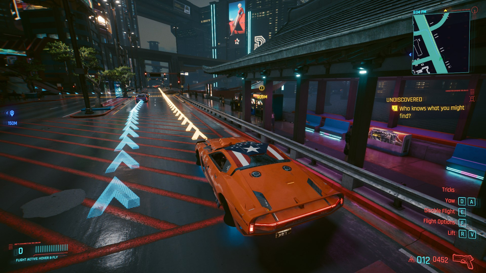

# Let There Be Flight

This is a mod (currently in a beta state) for Cyberpunk 2077 that adds a flying mechanism to all cars, with a couple different modes and options.

Other features include:
* In-world navigation for quests and player-selected destinations (with appropriate colors)
* Imminent explosion audio indicator
* Visual explosions happen more readily with other cars
* Quick-eject in flight mode (hold exit)

[Video preview of the Drone/Acrobat mode](https://www.youtube.com/watch?v=U9t2JWMY1-k)

## Installation

[Get the latest release here](https://github.com/jackhumbert/let_there_be_flight/releases) - `packed-v*.zip` in the release contains all of the requirements listed below at their most up-to-date versions (at the time of release). Simply extract it and copy the contents in your game's installation folder. If you're upgrading, you may want to delete the contents of the `r6/scripts/flight_control` folder, since files may have been renamed/removed.

If you want to install the mod outside of a release (not recommended), the `build/` folder in the repo contains all of the mod-specific files that you can drag into your game's installation folder.

## Requirements

* [RED4ext](https://github.com/WopsS/RED4ext)
* [TweakXL](https://github.com/psiberx/cp2077-tweak-xl)
* [Input Loader](https://github.com/jackhumbert/cyberpunk2077-input-loader)
* [Redscript](https://github.com/jac3km4/redscript)

## Bugs

If you come across something that doesn't work quite right, or interferes with another mod, [search for an issue!](https://github.com/jackhumbert/let_there_be_flight/issues) I have a lot of things on a private TODO list still, but can start to move things to Github issues.

**New issues/pull requests are disabled until I get things closer to a release and can manage things better.**

Special thanks to @psiberx for [Codeware Lib](https://github.com/psiberx/cp2077-codeware/), [InkPlayground Demo](https://github.com/psiberx/cp2077-playground), and Redscript & CET examples on Discord, @WopsS for [RED4ext](https://github.com/WopsS/RED4ext), @jac3km4 for [Redscript toolkit](https://github.com/jac3km4/redscript), @yamashi for [CET](https://github.com/yamashi/CyberEngineTweaks) and the [E-mode mod](https://www.nexusmods.com/cyberpunk2077/mods/3207?tab=description) (very helpful in figuring out how to work with FMOD), @rfuzzo & team (especially @seberoth!) for [WolvenKit](https://github.com/WolvenKit/WolvenKit), and all of them for being helpful on Discord.

Interested in adding flying vehicles or a similar mechanic to an existing game? Let me know!

Audio system made with [FMOD Studio](https://www.fmod.com/) by Firelight Technologies Pty Ltd.
